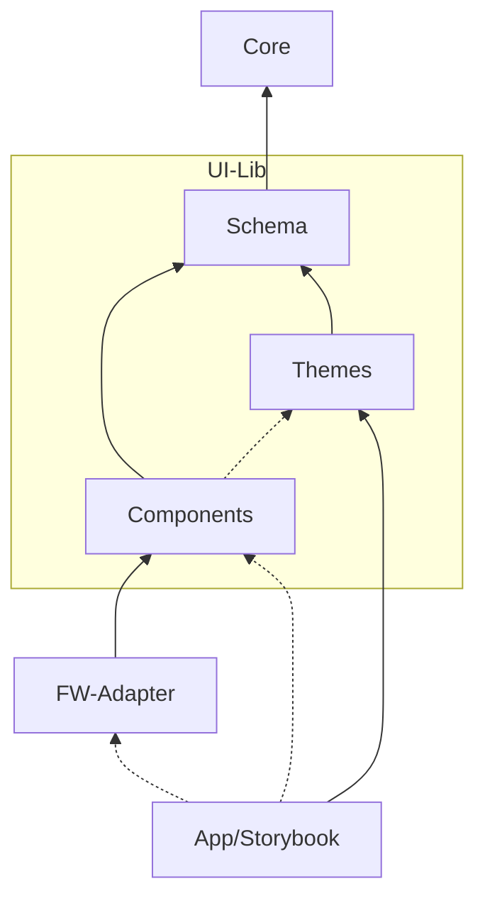
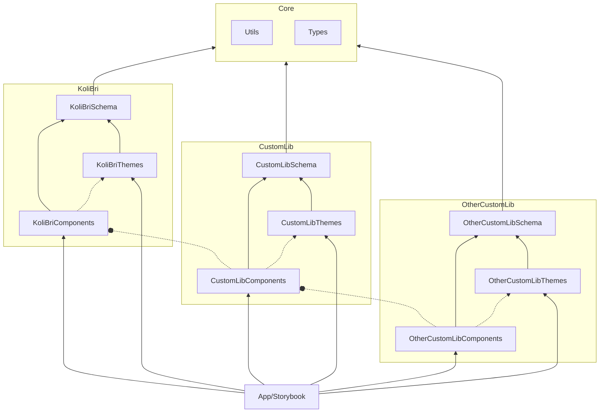
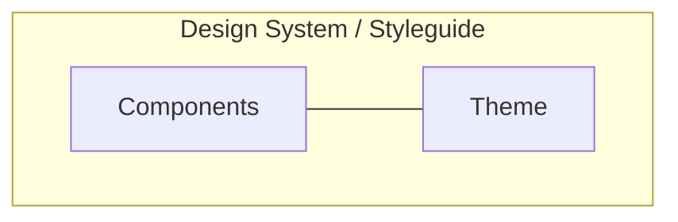

In order to make changes to KoliBri it is necessary to understand the module architecture (KoliBri Factory). More details are described in the section [Modularization](#modularization).

## Monorepo

The repository is built as a monorepo and is managed by `lerna`. The important thing here is that the individual submodules are dependent on other modules.

## Develop and change

For development, `pnpm` is used as package manager with `lerna` as monorepo manager.

### Install all

`pnpm i`

Once everything is installed, the individual modules can be modified and built.

The module `library` can be started via `pnpm start` and displayed in the browser.

### Clear all

`pnpm clean`

### Web Component module (library)

The Web Component module is located in the package directory (`packages/library`). After the general installation, the overview page of all components can be started with `npm start`. This is also used to build or modify components.

`npm start`

## Modularization

The goal of modularization is to limit the technical scope per module to its core task and thus also to simplify maintenance and further development.

In the core are functionalities, which proved with the time for helpful with the conversion of components and in principle in each Web Component Lib potentially to use could.

The schema, Components (still "Library"), Themes represent a concrete component library. Of it there could be several, which build onion-like from the inside (KoliBri) outward on each other (see below).

This practice promotes the emergence of new basic components from the subject-specific projects - which can be adopted and shared through a process in KoliBri after checking the qualities and standard.

### Simple

The following illustration shows the basic structure of a component library (UI-Lib):

| Module     | Description                                                                                                                                                                                                                                                                                                                                                                                                                                                    |
| ---------- | -------------------------------------------------------------------------------------------------------------------------------------------------------------------------------------------------------------------------------------------------------------------------------------------------------------------------------------------------------------------------------------------------------------------------- |
| Core       | The _Core_ module contains the overall architecture (Generic Types) and useful functionalities (Utils) for Web Components.                                                                                                                                                                                                                                                                                                 |
| UI-Lib     | The component library module contains its schema and the components and theme(s) associated with the schema.                                                                                                                                                                                                                                                                                                               |
| Schema     | The _Schema_ module is used for typed assurance that independently created themes are always compatible with the schema-specific components. **Note**: It seems obvious to the simplicity of the modules _Schema_ and _Components_ together. However, since the _Themes_ (then dependent on the _Components_ module) are helpful in implementing the components, this would lead to a technical dependency problem (loop). |
| Components | The _Components_ module contains the implementation of the Web Components.                                                                                                                                                                                                                                                                                                                                                 |
| App        | The app module represents a concrete application implementation based on the component library (UI lib).                                                                                                                                                                                                                                                                                                                   |
| Storybook  | The Storybook module serves as documentation and sample presentation for all stakeholders.                                                                                                                                                                                                                                                                                                                                 |

### Advanced

In the extended representation of the modularization it becomes visible, how by the decoupling “onion-like” more specific becoming component libraries can be strung together under an overall architecture.

## Design system / style guides (UX)

It is important to understand that within a component library (UI-Lib) a uniform operating behavior applies to the components, since these are implemented only once concretely and according to the requirements.

Within a component library, however, the possibility exists of creating several themes (styles). The theme is defined for this component-specific and loaded later with the components in pairs together.

### Where is the design system / style guide?

A theme represents a concrete combination of the components and a theme. This combination represents a concrete design system or style guide.

### Why?

The starting point of the explanation is the fact that HTML and CSS are already decoupled according to their specification.

Within a component library, the HTML is defined by the component implementation and the CSS through the style information.

**Why the modular separation then?**

The claim of the total architecture and the quality criteria connected with it aim at the fact that the basic components are implemented semantically only once, tested and accepted.

Here, the aim is to achieve the best possible structure (HTML) of the components between minimalism and flexibility and full compliance with HTML semantics. This premise pays into optimal compatibility with all devices and assistive technologies.

Concluding from this premise, it is clear that not all different aesthetic ideas and operating concepts from design systems and style guides can be implemented.

> It often happens that initial design systems and style guides had to be adapted later in the realization due to accessibility requirements, so that in the end they come very close again in many points that were seen critically at the beginning.

In the end, the web components are displayed on the devices of the users through a technical realization. The technology has, however, with all creativity borders and gaps. To fathom these additionally under all requirements, to delimit and to find solutions is particularly complex.

**In the end, the aim is to standardize at least all complex basic components that represent a hurdle in terms of accessibility and to offer the best possible designability in the process.**
