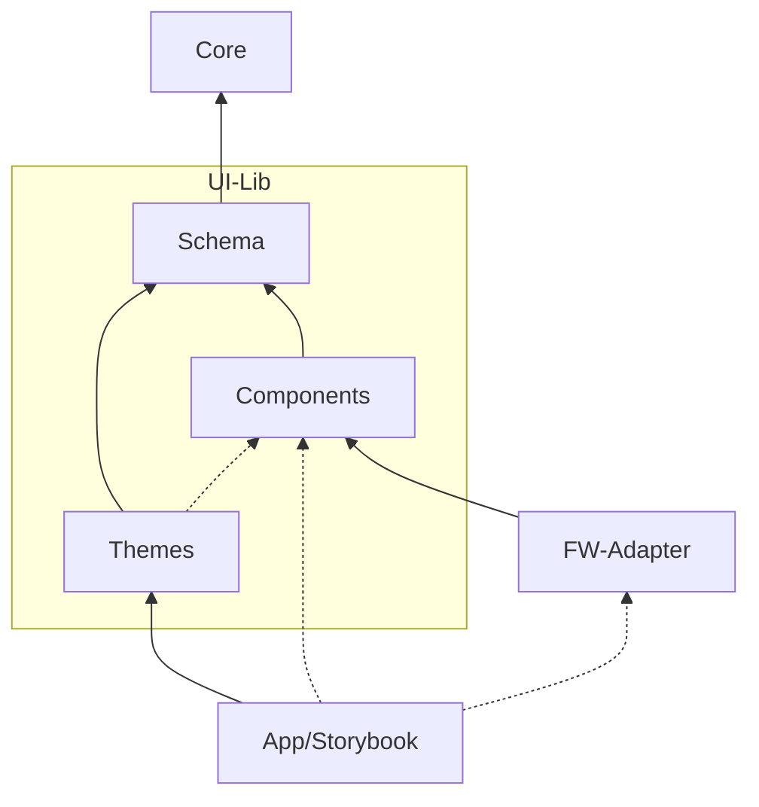
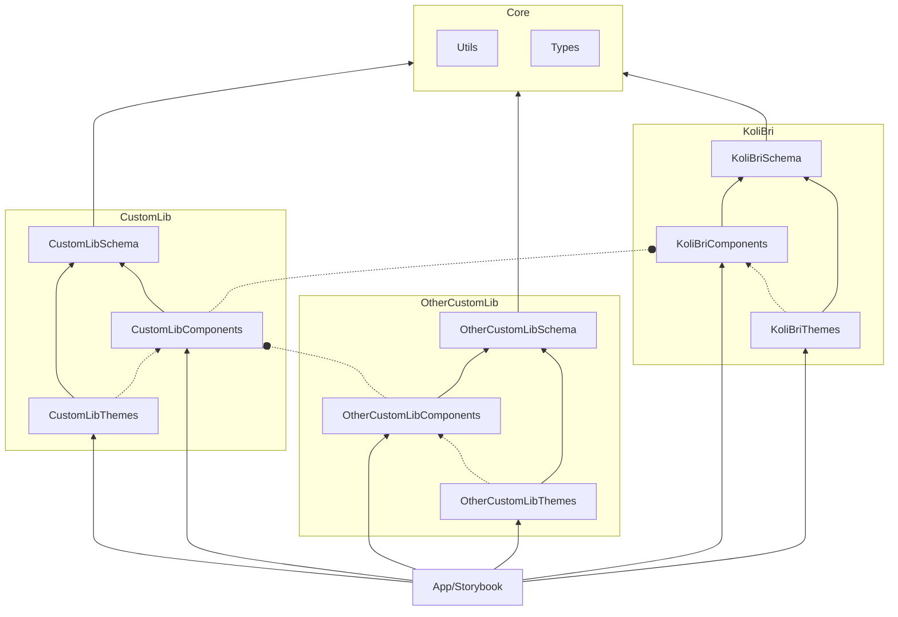
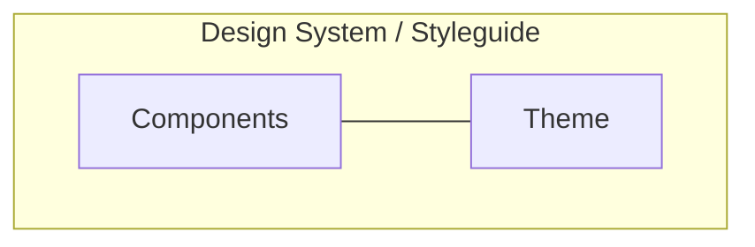

# Architektur

## Entwickeln und Ändern

Für die Entwicklung wird `pnpm` als Paketmanager in Verbindung mit `lerna` als Monorepo-Manager verwendet.

### Alles installieren

`pnpm i`

> Aufgrund der nicht öffentlich verfügbaren KoliBri-Pakete muss der `pnpm i` Befehl und der `pnpm :publish` Befehl abwechselnd ausgeführt werden, bis alle Pakete einmal in der lokalen Registry (verdaccio) liegen (`pnpm i` läuft komplett durch).

Sobald alles installiert ist, können die einzelnen Module modifiziert und gebaut werden.

Die Module `library` und `storybook` können insbesondere mittels `npm start` angesurft und im Browser angezeigt werden.

### Alles bereinigen

`pnpm clean`

### Web Component-Modul

Im Paket-Verzeichnis (`packages/components`) befindet sich das Web Component-Modul. Nach der generellem Installation kann mittels `npm start` die Übersichtsseite aller Komponenten gestartet werden. Diese wird auch verwendet, um Komponenten aufzubauen oder zu modifizieren.

`npm start`

## Modularisierung

Ziel der Modularisierung ist es den technischen Scope pro Modul auf dessen Kernaufgabe zu beschränken und damit auch die Pflege und Weiterentwicklung zu vereinfachen.

Im Kern befinden sich Funktionalitäten die sich mit der Zeit für hilfreich bei der Umsetzung von Komponenten erwiesen haben und prinzipiell in jeder Web Component-Lib potenziell zu Einsatz kommen könnten.

Das Schema, die Komponenten und Themes repräsentieren eine konkrete Komponentenbibliothek. Davon könnte es mehrere geben, die zwiebelartig von Innen (KoliBri) nach Außen aufeinander Aufbauen (s.u.).

Diese Praxis fördert die Entstehung neuer Basiskomponenten aus den fachspezifischen Projekten - die durch einen Prozess in KoliBri nach Prüfung der Qualitäten und Standard übernommen werden und mit anderen geteilt kann.

### Einfach

In der folgenden Darstellung wird der Grundaufbau einer Komponentenbibliothek (UI-Lib) dargestellt:

| Module     | Erläuterung                                                                                                                                                                                                                                                                                                                                                                                                                                                         |
| ---------- | ------------------------------------------------------------------------------------------------------------------------------------------------------------------------------------------------------------------------------------------------------------------------------------------------------------------------------------------------------------------------------------------------------------------------------------------------------------------- |
| Core       | Das _Core_-Modul beinhaltet die Gesamtarchitektur (Generic Types) und nützliche Funktionalitäten (Utils) für Web Components.                                                                                                                                                                                                                                                                                                                                        |
| UI-Lib     | Das Komponentenbibliotheks-Modul beinhaltet sein Schema und die zum Schema gehörigen Komponenten und Theme(s).                                                                                                                                                                                                                                                                                                                                                      |
| Schema     | Das _Schema_-Modul dient der typisierten Sicherstellung, dass unabhängig erstellte Themes stets kompatibel mit den Schema-spezifischen Komponenten sind.   **Hinweis:** Es scheint nahezuliegen der einfachheithalber die Module _Schema_ und _Components_ zusammenzuführen. Da jedoch die _Themes_ (dann abhängig vom _Components_-Modul) bei der Umsetzung der Komponenten hilfreich sind, würde das zu einem technischen Abhängigkeitsproblem führen (Loop). |
| Components | Das _Components_-Modul beinhaltet die Implementierung der Web Components.                                                                                                                                                                                                                                                                                                                                                                                           |
| App        | Das App-Modul repräsentiert eine konkrete Anwendungsimplementierung auf Basis der Komponentenbibliothek (UI-Lib).                                                                                                                                                                                                                                                                                                                                                   |
| Storybook  | Das Storybook-Modul dient als Dokumentation und Beispiel-Präsentation für alle Stakeholder.                                                                                                                                                                                                                                                                                                                                                                         |

### Erweitert

In der erweiterten Darstellung der Modularisierung wird sichtbar, wie durch die Entkopplung "zwiebelartig" spezifischer werdende Komponentenbibliotheken unter einer Gesamtarchitektur aneinander gereiht werden können.

## Design System / Styleguides (UX)

Es ist wichtig zu verstehen, dass innerhalb einer Komponentenbibliothek (UI-Lib) ein einheitliches Bedienverhalten für die Komponenten gilt. Da diese nur einmal konkret und den Anforderungen entsprechend umgesetzt werden.

Innerhalb einer Komponentenbibliothek besteht jedoch die Möglichkeit mehrere Themes (Styles) zu erstellen. Das Theme wird dazu Komponenten-spezifische definiert und später mit den Komponenten paarweise zusammen geladen.

### Wo ist das Design System / der Styleguide?

Ein Theme steht für eine konkrete Kombination aus den Komponenten und einem Theme. Genau diese Kombination repräsentiert dann ein konkretes Design System oder einen konkreten Styleguide.

### Warum?

Ausgangspunkt der Erläuterung ist die Tatsache, dass HTML und CSS gemäß ihrer Spezifikation schon entkoppelt sind.

Innerhalb einer Komponentenbibliothek wird das HTML mittels der Komponenten-Implementierung und das CSS mittels der Style-Informationen definiert.

**Wozu dann die modulare Auftrennung?**

Der Anspruch der Gesamtarchitektur und die damit verbundenen Qualitätskriterien zielen darauf ab, dass die Basiskomponenten nur einmal semantisch implementiert, erprobt und abgenommen werden.

Hier bei wird ein bestmöglicher Aufbau (HTML) der Komponenten zwischen Minimalismus und Flexibilität und der vollständigen Einhaltung der HTML-Semantik angestrebt. Diese Prämisse zahlt in die optimale Kompatibilität mit allen Geräten und assistiven Technologien ein.

Schlussfolgernd aus dieser Prämisse ist klar, dass nicht alle verschiedenen ästhetischen Ideen und Bedienkonzepte aus Design Systemen und Styleguides umgesetzt werden können.

> **Anmerkung:** Es kommt häufig vor, das initiale Design Systeme und Styleguides später in der Realisierung aufgrund der Anforderungen an die Barrierefreiheit angepasst werden mussten, so dass sie sich am Ende in vielen anfangs kritisch gesehenen Punkten wieder sehr nahe kommen.

Am Ende werden die Webkomponenten auf den Geräten der Nutzenden durch eine technische Realisierung zu Anzeige gebracht. Die Technik hat aber bei aller Kreativität Grenzen und Lücken. Diese zusätzlich unter allen Anforderungen zu ergründen, abzugrenzen und Lösungen zu finden, ist besonders aufwendig.

**Schlussendlich wird angestrebt mindestens alle komplexen Basiskomponenten, die im Bezug auf die Barrierefreiheit eine Hürde darstellen, zu standardisieren und dabei die bestmögliche Gestaltbarkeit anzubieten.**
